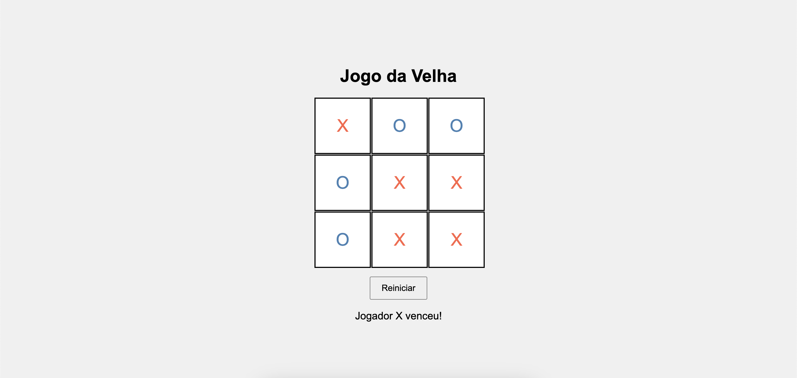

# 📝 Jogo da Velha (Tic-Tac-Toe)

Um jogo da velha (Tic-Tac-Toe) simples e jogável no navegador, criado usando HTML, CSS e JavaScript. Este projeto é totalmente responsivo e funciona em diversos navegadores.

<p align="center">
  
</p>

## 🚀 Demonstração

Você pode ver a aplicação em funcionamento [aqui](https://digonexs.github.io/simple-tic-tac-toe/).

## 📋 Funcionalidades

- Jogo para dois jogadores (X e O).
- Detecção de vitória ou empate.
- Interface responsiva que se adapta a diferentes tamanhos de tela.
- Suporte para múltiplos navegadores, incluindo Chrome, Edge, Mozilla, Opera e Safari.

## 🛠️ Tecnologias Utilizadas

- **HTML**: Estrutura básica da página.
- **CSS**: Estilos para o layout responsivo.
- **JavaScript**: Funcionalidade da aplicação.

## 📱 Responsividade

A aplicação é completamente responsiva, se adaptando a diferentes tamanhos de tela:

- Computadores de mesa
- Notebooks
- Tablets
- Celulares

Compatível com os principais navegadores:

- Google Chrome
- Edge
- Opera
- Safari
- Mozilla Firefox

## 📂 Estrutura de Arquivos

```plaintext
.
├── index.html
├── styles.css
└── script.js
```

## 📦 Como Usar

Clone o repositório:

```bash
git clone https://github.com/digonexs/simple-tic-tac-toe
```

Navegue até o diretório do projeto:

```bash
cd simple-tic-tac-toe
```

Abra o arquivo index.html em seu navegador preferido.

## 👨‍💻 Contribuindo

Contribuições são bem-vindas! Sinta-se à vontade para abrir issues e enviar pull requests. Para mudanças maiores, abra uma issue primeiro para discutir o que você gostaria de mudar.

## 📝 Licença

Este projeto está licenciado sob a Licença MIT.

Feito com ❤️ por [Rodrigo](https://www.linkedin.com/in/rodrigocavalcantedebarros/).
